# F´ Project Tutorial for STM32-Supported MCUs

>[!IMPORTANT]
> This project showcases the STM32H753XIH6 running on a STM32H753I-EVAL2 board as a worked example. Peripheral choice, pins, and clock configuration are always board-specific and require your own CubeMX configuration — but the `fprime-stm32 sync` step that wires CubeMX's generated code into the F' CMake build works for any STM32H7 chip/board, not just this one.

This tutorial targets F´ users deploying an F´ project on any F´-supported STM32 microcontroller. If you're new to F´ and want to learn the fundamentals — components, events, telemetry, commands, parameters, topology integration — before targeting embedded hardware, take the [LED Blinker tutorial](https://fprime.jpl.nasa.gov/latest/tutorials-led-blinker/docs/led-blinker) first.

This tutorial walks through creating, building, and deploying an F´ project on any Arm Cortex®-M-based STM32 microcontroller using the `fprime-stm32` and [`fprime-baremetal`](https://github.com/fprime-community/fprime-baremetal) libraries.

> [!TIP]
> The Reference Project for this tutorial is located at the [Fprime Baremetal Reference Project](https://github.com/Iva-L/fprime-baremetal-reference/tree/library-fprime-stm32). If you are stuck at some point during this tutorial, you may refer to that reference as the "solution".

## Prerequisites

Before starting, make sure you have:

1. Met the [F´ System Requirements](https://github.com/nasa/fprime?tab=readme-ov-file#system-requirements).
2. [F' installed](https://fprime.jpl.nasa.gov/latest/docs/getting-started/installing-fprime/) already.
3. An IDE or text editor supporting copy-paste.
> [!TIP]
> Using an IDE or text editor with FPP language support can significantly improve your development experience. [VSCode](https://code.visualstudio.com/) has [extensions](https://marketplace.visualstudio.com/items?itemName=jet-propulsion-laboratory.fpp) that support the FPP language syntax.
4. Any family-supported STM32 board.
5. [STM32CubeMX](https://www.st.com/en/development-tools/stm32cubemx.html) initialization code generator installed for STM32 hardware configuration.
> [!IMPORTANT]
> If you do not have the hardware yet, you can still follow this tutorial! You should just skip the Hardware sections.

## Troubleshooting

If at any point during this tutorial you encounter issues:

1. **Check your current directory:** Ensure you are in the correct directory as specified in each step of the tutorial.
2. **Activate your virtual environment:** Always make sure your F´ project's virtual environment is activated with `. fprime-venv/bin/activate`.
3. **Refer to the F´ troubleshooting guide:** Visit [F´ Installation and Troubleshooting](https://fprime.jpl.nasa.gov/latest/docs/getting-started/installing-fprime/#troubleshooting) for common installation and setup issues.
4. **Verify your F´ installation:** Run `fprime-util --help` to ensure F´ tools are properly installed.
5. **Verify your build environment:** Ensure that your project's build directory is clean and properly configured before attempting to build your F´ project. You can purge the CMake cache by running `fprime-util purge` in your project's build directory.
6. **Verify your toolchain:** Ensure that the toolchain required for building your F´ project is correctly installed and accessible in your environment. Also, check you are passing the correct toolchain name to your build commands, as in `fprime-util build <toolchain-name>`.


## Tutorial Steps

1. [Project Setup](#1-project-setup)
2. [Installing the ARM GNU Toolchain](#2-installing-the-arm-gnu-toolchain)
3. [Using `fprime-stm32`](#3-using-fprime-stm32)
4. [Adding the `/Hardware` Directory](#4-adding-the-hardware-directory)
5. [Adding the F´ Configuration Overrides](#5-adding-the-f-configuration-overrides)
6. [Creating a STM32CubeMX Project](#6-creating-a-stm32cubemx-project)
7. [Peripheral, Clock, and Middleware Configuration](#7-peripheral-clock-and-middleware-configuration)
8. [Creating a Custom STM32 Deployment](#8-creating-a-custom-stm32-deployment)
9. [Building the Project for STM32](#9-building-the-project-for-stm32)
10. [Running the Project on STM32](#10-running-the-project-on-stm32)
11. [Conclusion](#11-conclusion)

---

## 1. Project Setup

> [!NOTE]
> If you have followed the [LED Blinker tutorial](https://fprime.jpl.nasa.gov/latest/tutorials-led-blinker/docs/led-blinker) previously, this step is identical.

**Goal.** Bootstrap a new F´ project pinned to a known-good toolchain version — the foundation every later step builds on.

**Execution.**
1. Confirm you meet the [F´ System Requirements](https://github.com/nasa/fprime?tab=readme-ov-file#system-requirements).
2. [Bootstrap your F´ project](https://fprime.jpl.nasa.gov/latest/docs/getting-started/installing-fprime/#creating-a-new-f-project) with the name of your project. This tutorial uses `stm32h7-project` as the project name and `Stm32h7Project` as the project namespace.

Bootstrapping creates a `stm32h7-project` directory (or whichever name you chose) containing the standard F´ project structure, along with a virtual environment holding the F´ tooling.

Navigate to your project directory and activate your virtual environment if you have not already done so:
```sh
cd stm32h7-project
. fprime-venv/bin/activate
```

## 2. Installing the ARM GNU Toolchain

**Goal.** Install the ARM GNU Toolchain — `fprime-stm32` requires it to cross-compile for Cortex-M targets.

**Rationale.** Your host `gcc`/`g++` target your workstation's ISA. Cortex-M7 requires a cross-compiler emitting Thumb-2/ARMv7E-M code, paired with `arm-none-eabi` builds of `libc`/`libstdc++` that omit OS-dependent syscalls — a prerequisite for the `--specs=nosys.specs` link stage wired in step 8b.

If you already have the ARM GNU Toolchain installed, you can skip this step. Otherwise, follow the instructions below to install it.

**Execution.** For Ubuntu-based systems, you can install the ARM GNU Toolchain using the following commands:
```sh
# Update package lists and install the ARM GNU Toolchain
sudo apt-get update

# Install the ARM GNU Toolchain
sudo apt-get install -y gcc-arm-none-eabi libnewlib-arm-none-eabi libstdc++-arm-none-eabi-dev
```
> [!IMPORTANT]
> If you are using a different operating system, refer to the official [ARM GNU Toolchain installation guide](https://learn.arm.com/install-guides/gcc/arm-gnu/) for your platform.

**Verification.** Confirm the installation by checking the version of the ARM GNU Toolchain:
```sh
arm-none-eabi-gcc --version
arm-none-eabi-g++ --version
```
## 3. Using `fprime-stm32`

**Goal.** Pull in `fprime-baremetal` and `fprime-stm32` as submodules and register their `config/` search paths with F´.

**Rationale.** `fprime-stm32` provides the STM32 HAL integration, linker/startup patching, and hardware drivers used later in this tutorial; it depends on `fprime-baremetal` for the underlying bare-metal OSAL. That OSAL is what makes the rest of this tutorial possible on hardware with no operating system: `Os::Task` becomes a cooperative cyclic-executive runner instead of a POSIX thread, `Os::Mutex` implements mutual exclusion with `PRIMASK` critical sections instead of `pthread_mutex_t`, and `Os::RawTime` is sourced from a free-running hardware timer (TIM2, configured in step 7) instead of a POSIX monotonic clock. Neither library ships with a bootstrapped F´ project, so both must be added explicitly.

**Execution.** Add the `fprime-baremetal` package as a submodule inside the `lib/` directory of your project:
```sh
# In stm32h7-project
git submodule add https://github.com/fprime-community/fprime-baremetal.git lib/fprime-baremetal
git submodule update --init --recursive
```

Add the `fprime-stm32` package as a submodule inside the `lib/` directory of your project:
```sh
git submodule add https://github.com/fprime-community/fprime-stm32.git lib/fprime-stm32 # Update this URL when fprime-stm32 library releases
git submodule update --init --recursive
```

Finally, edit the `settings.init` file in your root project directory to register both libraries' search paths. Add the following line just below `framework_path: ./lib/fprime`:

```ini
library_locations: ./lib/fprime-baremetal:./lib/fprime-stm32
```

## 4. Adding the `/Hardware` Directory

**Goal.** Establish the `/Hardware` directory that will hold your board's CubeMX-generated HAL code, and install the CLI that keeps it wired into the F´ CMake build.

**Rationale.** `fprime-stm32` doesn't ship board-specific HAL code — clock trees, pin muxing, and peripheral initialization are inherently board-specific and are generated by CubeMX, not templated by the library. `/Hardware` is the fixed location the `fprime-stm32` CLI expects that generated output to live in.

**Execution.** Copy the hardware template directory for your board's family MCU from the `fprime-stm32` package:

```sh
# In stm32h7-project
cp -r lib/fprime-stm32/fprime-stm32/Templates/stm32h7/Hardware Stm32h7Project
```

Inside the `/Hardware` directory, you can find the hardware-specific configurations for your STM32 project. You can now modify these files according to your project's requirements.

You'll also need the `fprime-stm32` CLI tool, which wires a CubeMX-generated project into this `/Hardware` directory and the F' CMake build for you:

```sh
# In stm32h7-project
pip install -e lib/fprime-stm32/tools/fprime-stm32-cli
```

## 5. Adding the F´ Configuration Overrides

**Goal.** Override F´'s framework-wide constants so every buffer, queue, and hash table fits the STM32H7's memory budget.

**Rationale.** On Linux or POSIX-based targets, F´ relies on OS-backed dynamic allocation and generous default memory limits. Spaceflight software enforces a strict **zero dynamic memory allocation policy after boot**: every task stack, telemetry buffer, and message queue must be sized and statically allocated up front, before the cyclic executive's run loop ever starts. F´ enforces this contract at link time rather than by convention alone — `Os_Baremetal_OverrideNewDelete`, linked in automatically in step 8b, traps calls to `operator new`/`delete`, so any component that tries to allocate dynamically after bootstrap fails loudly instead of silently degrading against a heap that doesn't exist on this target.

Microprocessors (MPUs) running Linux have ample RAM to absorb large default buffers. Bare-metal microcontrollers (MCUs) do not. The **STM32H753xx** series, for instance, has **2 MB of Flash** and only **1 MB of RAM**, split across DTCM and AXI SRAM banks. F´'s desktop-tuned defaults will exhaust that RAM well before your topology finishes initializing if left unadjusted.

F´ resolves this through project-local overrides of its framework-wide constants, placed in your project's `config/` directory. These overrides let you scale down default buffer sizes, queue capacities, max string lengths, and component hash tables to fit the exact RAM budget of your MCU.

### 5a. Copying the Configuration Overrides Template

**Execution.** To apply the bare-metal memory configuration for the STM32H7, copy the template files from the `fprime-stm32` library into your project's `config/` directory:

```bash
# In stm32h7-project
cp -r lib/fprime-stm32/fprime-stm32/Templates/stm32h7/config Stm32h7Project
```

> [!NOTE]
> This template pre-configures key F´ settings (such as `AcConstants.fpp`, `FpConstants.fpp`, and `TlmChanImplCfg.hpp`) to fit comfortably within the 1 MB RAM limit of the STM32H753xx series. If you are targeting an MCU with a smaller memory footprint (such as an STM32F4 or STM32F7 with 128–512 KB RAM), you will need to further tune queue depths, telemetry hash bucket sizes, and buffer capacities within the files in `config/`.

Finally, inside your project's `settings.ini` file, make sure to include the path to your `config/` directory so that F´ picks up your custom configuration overrides. Just below the `library_locations:` line add:

```ini
config_directory: ./config
```

**Verification.** This ensures that F´ will use your custom configuration settings from the `config/` directory on the next `fprime-util generate`.

In the next step we will be creating a STM32CubeMX project for your STM32 MCU to configure the peripherals and generate the initialization code.


## 6. Creating a STM32CubeMX Project

**Goal.** Generate the board-specific HAL libraries and initialization code F´ needs to interface with your hardware.

**Rationale.** CubeMX is the source of truth for clock tree configuration, pin muxing, and HAL module selection — none of this can be templated generically, since it depends entirely on your chip and board. Setting **Toolchain/IDE** to **CMake** is mandatory, not cosmetic: it's what makes CubeMX generate `cmake/stm32cubemx/CMakeLists.txt`, which `fprime-stm32 sync` reads to learn which chip, HAL modules, and peripheral-init files your project actually needs.

**Execution.**
1. Open STM32CubeMX and create a new project for your STM32 MCU.
2. Configure the peripherals and middleware according to your project requirements.
3. In Project Manager -> Project, set **Toolchain/IDE** to **CMake**.
4. Generate the project directly into a new subdirectory of `Hardware/`, named after your chip (e.g. `Hardware/stm32h743_hal/` for an STM32H743). Generate the initialization code and HAL libraries.
5. Run `fprime-stm32 sync Hardware/<name>_hal` to wire that generated project into the F' CMake build. You never hand-copy or hand-edit `Hardware/CMakeLists.txt`, `Hardware/linker/`, or `Hardware/startup/` yourself.

> [!NOTE]
> If you have worked with STM32CubeMX before, this process should feel familiar...
> But if you are new to STM32CubeMX, follow the next creation example carefully to set up your project correctly.

Here is an example of how to create a STM32CubeMX project for the STM32H753XIH6 MCU running on a STM32H753I-EVAL2 development board:

### 1. Open STM32CubeMX and select "ACCESS TO MCU SELECTOR".

<p align="center">
  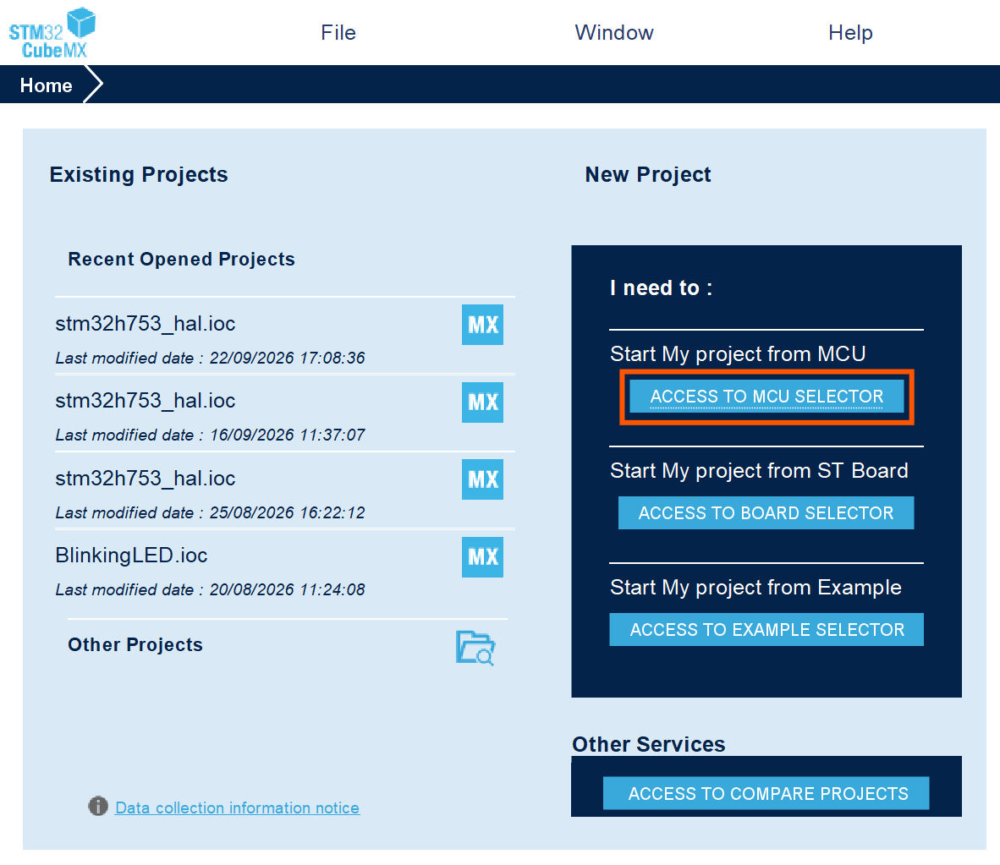
</p>

> [!NOTE]
> If you will be working on a commercial STM32 development board, select "ACCESS TO BOARD SELECTOR" and make sure to select the correct board to ensure proper configuration and initialization.

### 2. Choose your specific STM32H7 MCU or development board and click "Start Project".

For this project, we will be using the STM32H753XIH6 MCU:

<p align="center">
  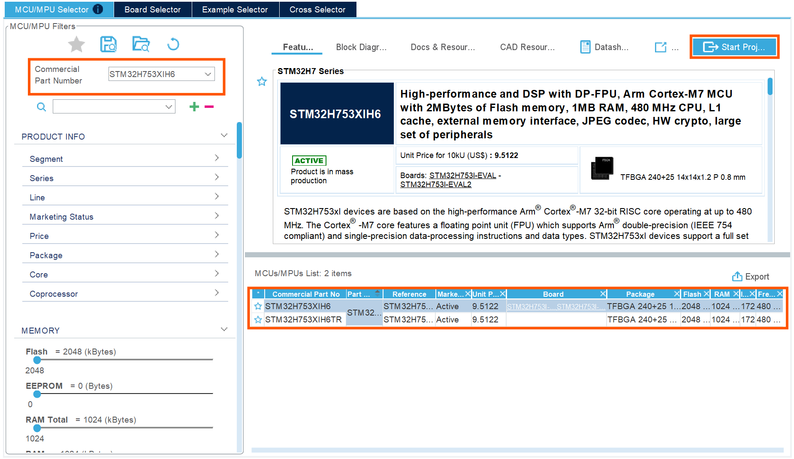
</p>

> [!NOTE]
> This MCU has a Memory Protection Unit (MPU) and supports various high-speed peripherals, making it suitable for complex embedded applications, but it's not yet supported by `fprime-stm32`. Select no when prompted after clicking "Start Project" to enable the MPU.

## 7. Peripheral, Clock, and Middleware Configuration

With the STM32CubeMX project open, we can now proceed to configure the peripherals, clock settings, and middleware required for our application.

### 1. One GPIO pin as an output to control an LED _(GPIO_PORT_F, GPIO_PIN_10)_.
* For this, select pin PF10 in the pinout view and configure it as an output:

<p align="center">
  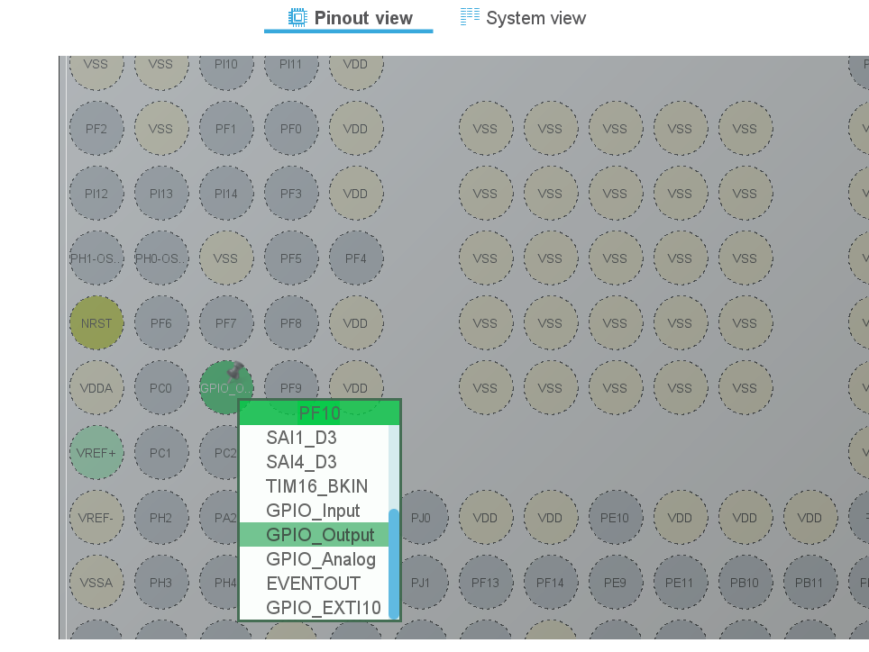
</p>


### 2. One UART interface for serial communication _(USART1)_.

> [!IMPORTANT]
> It is important to configure the UART interface exactly as specified to ensure proper communication with the gds system.

* First go to the "Connectivity" section in STM32CubeMX and select "USART1" to configure the UART interface. Here select the mode as "Asynchronous" and disable hardware flow control (RS232).

* It is necessary for `USART1` to have DMA enabled for efficient data transfer. DMA moves this transfer off the CPU entirely — the `Stm32UartDriver` stages TX/RX data in DMA-accessible buffers in AXI SRAM rather than in CPU-only DTCM, so the transfer proceeds independently of the cyclic executive's dispatch loop. As this port will be used for communication with the gds system, make sure to enable DMA for both TX (`DMA_Stream_0`) and RX (`DMA_Stream_1`) channels in the STM32CubeMX configuration by clicking the "ADD" button.

<p align="center">
  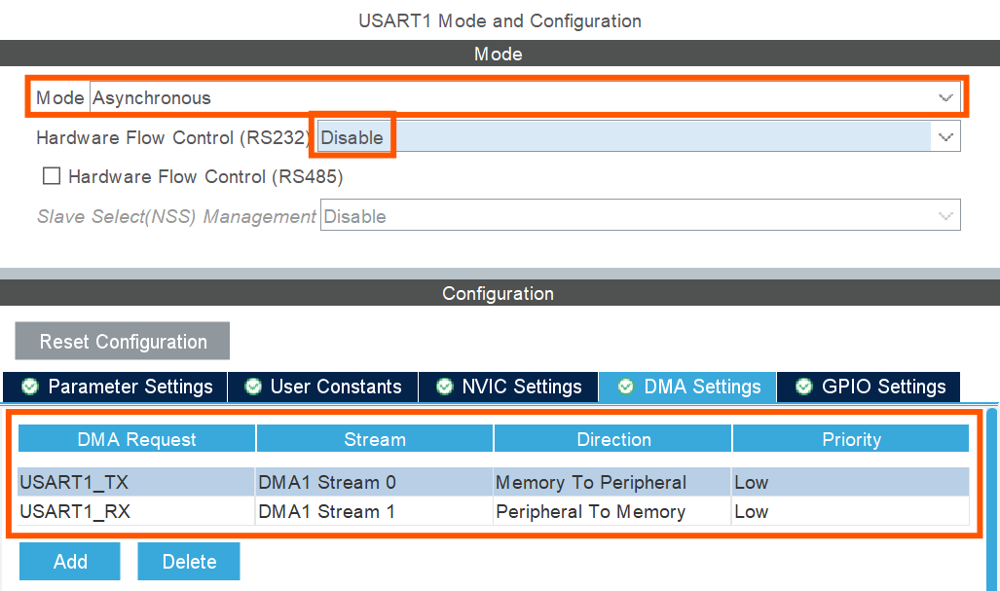
</p>

<div style="display: flex; gap: 20px; justify-content: center;">
<div>

* `USART1_TX` will be configured on pin `PB14`, as we are working on the STM32H753I-EVAL2 development board, and this pin corresponds to the TX function for USART1 on this board.

<p align="center">
  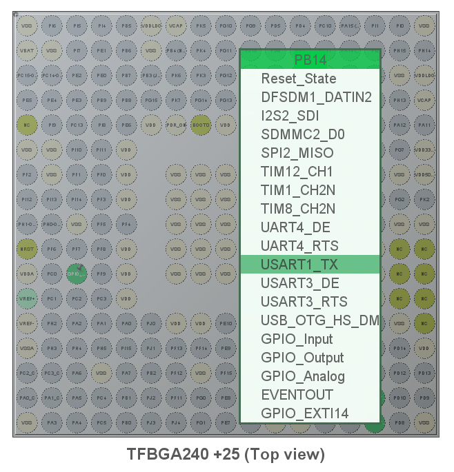
</p>
</div>

<div>

* `USART1_RX` will be configured on pin `PB15`, as this pin corresponds to the RX function for USART1 on the STM32H753I-EVAL2 development board.

<p align="center">
  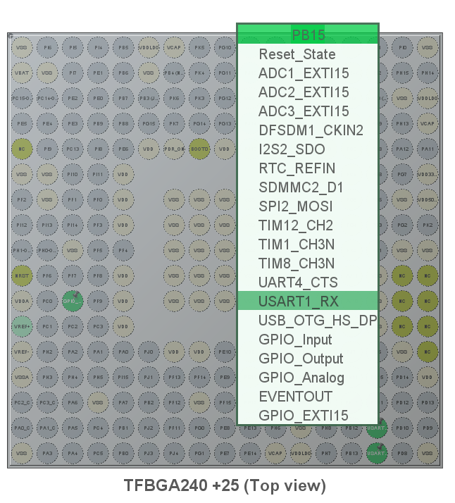
</p>
</div>
</div>


* Ensure that the parameter settings for `USART1` match the following configuration for communication with the gds system:

<div style="display: flex; gap: 20px; justify-content: center;">

<div>

| Basic Parameters |  |
|---|---|
| **Parameter** | **Value** |
| Baud Rate | 115200 |
| Word Length | 8 Bits |
| Stop Bits | 1 |
| Parity | None |
| Hardware Flow Control | None |
| Mode | Asynchronous |
</div>

<div>

| Advanced Parameters |  |
|---|---|
| **Parameter** | **Value** |
| Data Direction | Receive and Transmit |
| Over Sampling | 16 Samples |
| Single Sample | Disable |
| ClockPrescaler | 1 |
| Fifo Mode | Disable |
| Rxfifo Threshold | 1/8 Full |
| Txfifo Threshold | 1/8 Full |
</div>

<div>

| Advanced Features |  |
|---|---|
| **Parameter** | **Value** |
| Auto Baud Rate | Disable |
| TX Pin Active Level Inversion | Disable |
| RX Pin Active Level Inversion | Disable |
| Data Inversion | Disable |
| Tx and Rx Pin Swapping | Disable |
| Overrun | Enable |
| DMA on RX Error | Enable |
| MSB First | Disable |
</div>
</div>

### 3. Clock Configuration
Because TIM2 is used as a custom microsecond clock, it is necessary to configure the clock source first before setting the prescaler for the desired timing resolution.

* First go to System Core -> RCC (Reset and Clock Control) and configure the High Speed External (HSE) clock as Crystal/Ceramic Resonator.

<p align="center">
  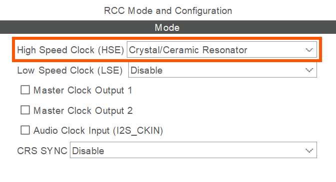
</p>

* Then, go to the clock configuration window and ensure that the HSE clock is selected as the PLL source for the system clock and modify the prescalers as needed to achieve the desired system clock frequency. Because for this MCU the maximum system clock frequency is 480 MHz, the prescalers were configured as follows:

<div style="display: flex; gap: 20px; justify-content: center;">

<div>

| Clock Configuration| |
|---|---|
| **Prescaler** | **Value** |
| `DIVM1` | /5 |
| `DIVN1` | x192 |
| `DIVVP2` | /2 |
| `D1CPRE` | /1 |
| `HPRE` | /1 |
| `D1PPRE` | /2 |
| `D2PPRE1` | /2 |
| `D2PPRE2` | /2 |
| `D3PPRE` | /2 |
</div>

<p align="center">
  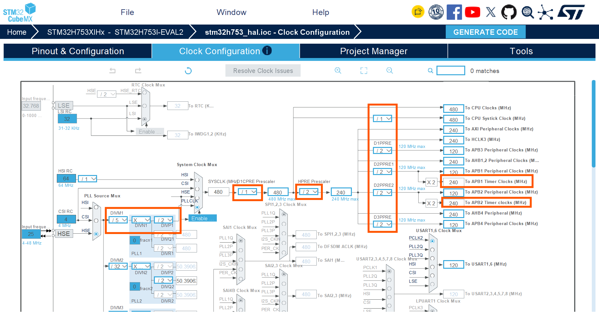
</p>

</div>

> [!NOTE]
> The clock configuration will vary for every project and microcontroller, so always double-check the settings for your specific hardware.

### 4. One Timer peripheral for the custom microsecond clock _(TIM2)_.

TIM2 is configured as a custom microsecond clock for precise timing operations, replacing the default system tick timer. This is the hardware counter the `Os::RawTime` OSAL delegate reads from — a free-running 1 MHz timer gives microsecond-resolution timestamps with none of the drift or syscall overhead a software-maintained tick would introduce. To configure it, first enable the TIM2 peripheral clock and set up the timer for a 1 MHz frequency to achieve microsecond resolution.

* Go to `Timers -> TIM2 -> Mode` and configure its source as the internal clock.
<p align="center">
  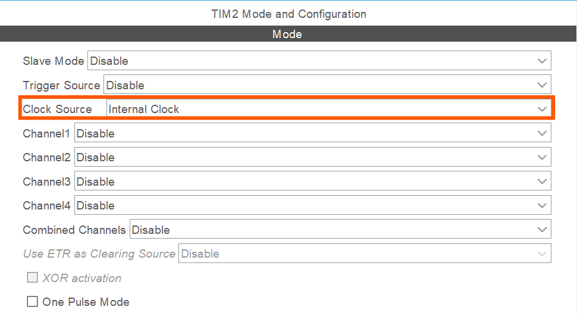
</p>

* Set the prescaler to achieve a `1 MHz` timer clock. For this project the `APB1` timer clock is `240 MHz`, so the prescaler should be set to `239`.
<p align="center">
  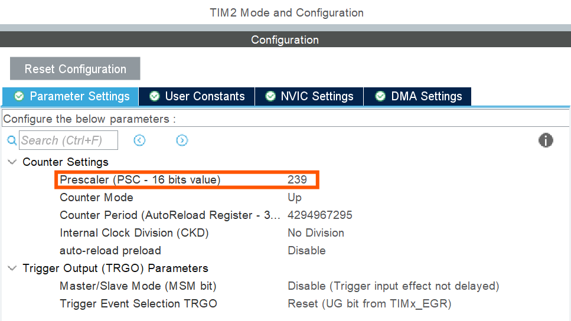
</p>

> [!TIP]
> Look at your APB1 timer clock frequency to achieve the desired 1 MHz timer clock. You can calculate the prescaler value as `(APB1 timer clock / 1 MHz) - 1`.

* Finally, enable the `TIM2` interrupt, as the timer will generate update events that drive the microsecond clock and rate groups.
<p align="center">
  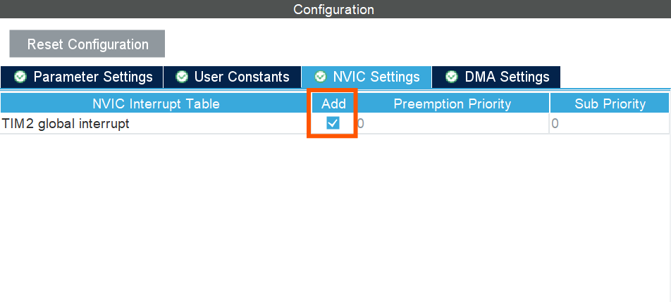
</p>

### 5. Generate the project directly into `Hardware/stm32h753_hal/` (Toolchain/IDE must be set to "CMake").

Now that the hardware has been configured, you can proceed to set up your project directory inside the "Project Manager" window in STM32CubeMX.

The `fprime-stm32 sync` tool needs the project name and directory to be in the `Hardware/` subdirectory, and the name of the directory should end with `_hal`. The recommended convention is to match the STM32 series and part number, for example `stm32h753_hal`.

```
Hardware/
└── stm32h753_hal/
```

Also, it is important to ensure the toolchain is set to **"CMake"** in the STM32CubeMX project settings, as this allows the generated project to be compatible with the F' build system, which relies on CMake for building and linking the project correctly.

If you are working with the STM32H753 series, your project directory should be named `stm32h753_hal` and placed under the `Hardware/` subdirectory:

<p align="center">
  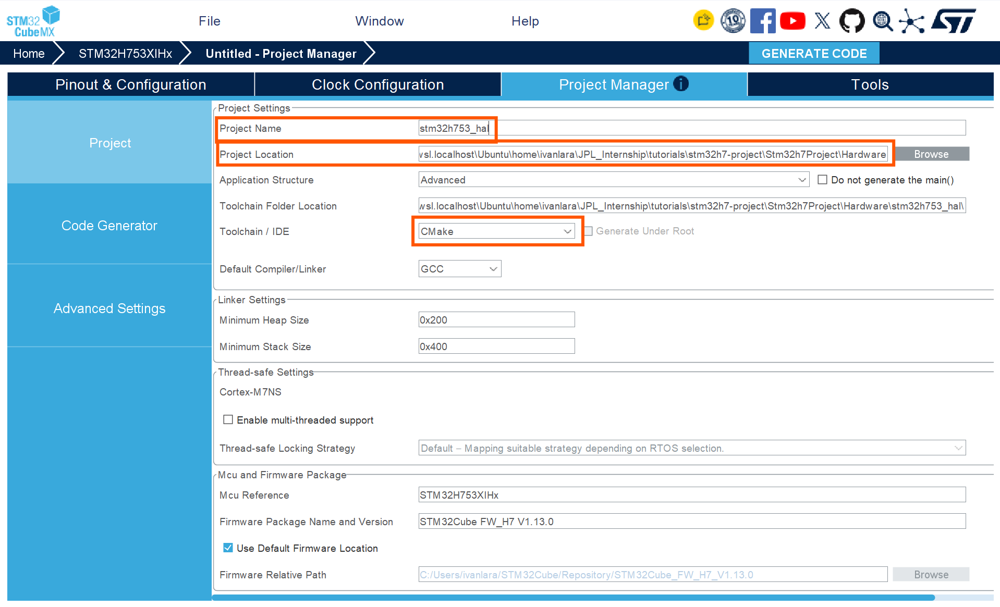
</p>

For CubeMX to generate all the HAL libraries inside the `Drivers/` directory, make sure that "Generate peripheral initialization as a pair of `.c/.h` files" as well as "Copy all used libraries into the project folder" are enabled in the CubeMX project settings. You can find these options under **Project Manager -> Code Generator**:

<p align="center">
  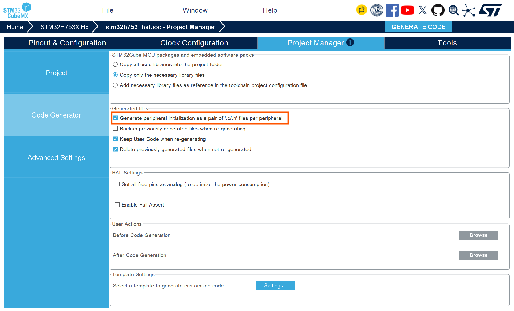
</p>

Now that you have configured the project settings and ensured the toolchain is set to "CMake", select **"Project -> Generate Code"** to generate the project files into the specified directory.

A confirmation message should appear indicating that the project has been successfully generated, and the files should now be present in the `Hardware/stm32h753_hal/` directory, following this structure:

```
Hardware/
└── stm32h753_hal/
    ├── cmake/
    ├── Core/
    ├── Drivers/
    ├── .mxproject
    ├── CMakeLists.txt
    ├── CMakePresets.json
    ├── startup_stm32h753xx.s
    ├── stm32h753_hal.ioc
    └── STM32H753xx_FLASH.ld
```

With the project structure in place and the necessary files generated, you are now ready to synchronize the project with the F' build system.

### 6. Run `fprime-stm32 sync` to wire the generated project into the F' CMake build:

**Rationale.** CubeMX's generated linker script and startup file assume a single flat RAM region and a hosted (or no) runtime — neither matches F´'s bare-metal, zero-dynamic-memory architecture. `fprime-stm32 sync` patches both to route DMA-safe buffers into AXI SRAM and CPU-only execution state (stacks, `.data`/`.bss`) into DTCM, then regenerates the CMake glue so the rest of the F´ build picks up exactly the HAL sources your peripheral configuration needs.

The library `fprime-stm32` includes a CLI tool that allows you to synchronize your CubeMX-generated project with the F' build system. It ensures that the necessary modifications are made to the linker script and startup files, and updates the CMake build configuration accordingly. If you have not installed the tool yet, you can do so by running:

```sh
# In stm32h7-project
pip install -e lib/fprime-stm32/tools/fprime-stm32-cli
```

Then, you can synchronize your CubeMX-generated project with the F' build system by running in your project root directory:

```sh
# In stm32h7-project
fprime-stm32 sync Stm32h7Project/Hardware/stm32h753_hal/
```

This patches the CubeMX-generated linker script and startup file for F´'s bare-metal zero-dynamic-memory architecture (DMA-safe buffers in AXI SRAM, CPU-only state in DTCM), writes them to `Hardware/linker/` and `Hardware/startup/`, and regenerates `Hardware/CMakeLists.txt` from CubeMX's own `cmake/stm32cubemx/CMakeLists.txt` so the `FprimeStm32` library target picks up exactly the HAL sources/includes/defines your peripheral configuration needs - for any STM32H7 chip, not just the STM32H753XIH6 used in this example. It also wires `Hardware/` and `config/` into the project's CMake build graph (the root and namespace `CMakeLists.txt` files), and exports three CMake cache variables from `Hardware/CMakeLists.txt` - `FPRIME_STM32_LINKER_SCRIPT`, `FPRIME_STM32_STARTUP_SOURCE`, `FPRIME_STM32_IT_SOURCE` - that a deployment's own `CMakeLists.txt` needs to reference. Add `--dry-run` first to preview the changes.

You don't have a deployment yet at this point in the tutorial (that's step 8), so there's nothing for `sync` to wire there yet - it'll tell you so. Once you've created one, re-run this same `sync` command with `--wire-deployment <name>` (step 8b) to finish connecting it to the STM32 build - no hand-written CMake required.

**Verification.** Re-run `fprime-stm32 sync` any time you regenerate `Hardware/stm32h753_hal/` from CubeMX (e.g. after adding a peripheral). It re-derives everything from the current CubeMX output and preserves any project-specific linker placement rules you've hand-added since the last sync (e.g. pinning a specific symbol into DTCM), and every file it touches is patched idempotently - re-running it again once everything is already wired makes no further changes.

## 8. Creating a Custom STM32 Deployment

**Goal.** Create the deployment that defines how your F´ components are wired together and configured for the STM32 target.

Create a new deployment with the following:

```sh
# In stm32h7-project
cd Stm32h7Project
mkdir -p Deployments
cd Deployments
fprime-util new --deployment
```

This will ask for some input, respond with the answers `Stm32h7Deployment` for the deployment name, accept the default `Deployments` for the deployment namespace, and `3` for the communication driver type (UART), shown below:

```
  [1/3] Deployment name (MyDeployment): Stm32h7Deployment
  [2/3] Deployment namespace (Deployments): Deployments
  [3/3] Select communication driver type
    1 - TcpClient
    2 - TcpServer
    3 - UART
    Choose from [1/2/3] (1): 3
[INFO] Found CMake file at 'stm32h7-project/Stm32h7Project/CMakeLists.txt'
Add Deployments/Stm32h7Deployment to stm32h7-project/Stm32h7Project/CMakeLists.txt at end of file? (yes/no) [yes]: yes
```
This will create a new deployment directory under `Deployments/Stm32h7Deployment` and update your `CMakeLists.txt` to include this deployment.

This deployment is not yet fully configured. As it uses the default Linux drivers, we will need to update it to use the STM32 drivers for UART, timer, and GPIO already provided by the `fprime-stm32` library.

### 8a. Updating the Deployment instances and topology

**Rationale.** `fprime-util new --deployment` scaffolds a topology built for the Linux OSAL: `Svc.LinuxTimer`, `Drv.LinuxUartDriver`, POSIX-sized queues and stacks, and a heap-backed `Fw::MallocAllocator`. None of that exists on bare metal — this section swaps each piece for its bare-metal counterpart.

First, we will tailor the default queue and stack sizes for the STM32 deployment — you need to modify the `instances.fpp` file. Task stacks are carved from DTCM, the zero-wait-state RAM bank reserved for CPU-only execution state; DTCM on the STM32H753xx is a fraction of total system RAM, so every active component's stack allocation competes for that same fixed pool. Shrinking `STACK_SIZE` from the Linux-scaled 64 KB default to 8 KB, and `QUEUE_SIZE` from 10 to 4, keeps the sum of all statically-allocated task stacks inside DTCM's budget.

In your `Deployments/Stm32h7Deployment/` directory, open the `instances.fpp` file and look for the following block of code:

```fpp
module Default {
    constant QUEUE_SIZE = 10
    constant STACK_SIZE = 64 * 1024
  }
```

and replace it with the following:

```fpp
  module Default {
    constant QUEUE_SIZE = 4
    constant STACK_SIZE = 8 * 1024
  }
```

This reduces the default queue and stack sizes to better match the constraints of the STM32 microcontroller, from 10 queues and 64 KB stacks to 4 queues and 8 KB stacks.

Then go to the bottom of the file, in the passive component instances section, to update the instances. Look for these drivers:

```fpp
  # ----------------------------------------------------------------------
  # Passive component instances
  # ----------------------------------------------------------------------

  instance chronoTime: Svc.ChronoTime base id 0x10010000

  instance rateGroupDriver: Svc.RateGroupDriver base id 0x10011000

  instance systemResources: Svc.SystemResources base id 0x10012000

  instance timer: Svc.LinuxTimer base id 0x10013000

  instance comDriver: Drv.LinuxUartDriver base id 0x10014000
```

and replace them with the STM32 drivers as follows:

```fpp
  # ----------------------------------------------------------------------
  # Passive component instances
  # ----------------------------------------------------------------------

  instance osTime: Svc.OsTime base id 0x10010000

  instance rateGroupDriver: Svc.RateGroupDriver base id 0x10011000

  instance systemResources: Svc.SystemResources base id 0x10012000

  instance timer: Stm32.STM32Timer base id 0x10013000

  instance comDriver: Stm32.Stm32UartDriver base id 0x10014000

  instance gpioDriver: Stm32.Stm32GpioDriver base id 0x10015000

```

`Svc.OsTime` replaces `Svc.ChronoTime`: both are F´'s generic time service, but `OsTime` sources timestamps through the `Os::RawTime` delegate, which on `fprime-baremetal` reads the free-running TIM2 hardware counter configured in step 7 rather than querying a Linux system clock. The remaining STM32-specific drivers replace their Linux equivalents outright, including the addition of a GPIO driver for general-purpose input/output.

To indicate the instances used for this deployment's topology, we will need to update the corresponding `topology.fpp` file. In the "Instances used in the topology" section, make sure to reference the updated STM32-specific instances, such as `osTime` and `gpioDriver`, instead of the default Linux instances — going from the following instances:

```fpp
  # ----------------------------------------------------------------------
  # Instances used in the topology
  # ----------------------------------------------------------------------
    instance chronoTime
    instance rateGroup_1Hz
    instance rateGroup_0_5Hz
    instance rateGroup_0_25Hz
    instance rateGroupDriver
    instance systemResources
    instance timer
    instance comDriver
    instance cmdSeq
```

to the following updated instances, which include the STM32-specific drivers:

```fpp
  # ----------------------------------------------------------------------
  # Instances used in the topology
  # ----------------------------------------------------------------------
    instance osTime
    instance rateGroup_1Hz
    instance rateGroup_0_5Hz
    instance rateGroup_0_25Hz
    instance rateGroupDriver
    instance systemResources
    instance timer
    instance comDriver
    instance cmdSeq
    instance gpioDriver
```

In the pattern graph specifiers, simply replace the `chronoTime` instance with the `osTime` instance to reflect the STM32-specific timing component. Replace the following:

```fpp
        time connections instance chronoTime
```

with:

```fpp
        time connections instance osTime
```

Now let's add the connection for the UART driver in the RateGroups connections, so that the 1 Hz rate group can trigger the UART driver. In your `topology.fpp` file, under the `connections RateGroups` section with the 1 Hz rate group, add the following line:

```fpp
      rateGroup_1Hz.RateGroupMemberOut[6] -> comDriver.run
```

This connection ensures that the UART driver is triggered by the 1 Hz rate group, allowing it to run periodically as specified by the rate group.

So far, we have updated the `.fpp` files only, and no changes have been made to the source code files yet. Now open your source code file `Stm32h7DeploymentTopology.cpp` to make the necessary updates.

First, we will replace the current `MallocAllocator.hpp` include with the STM32-specific allocator header. Replace:

```cpp
#include <Fw/Types/MallocAllocator.hpp>
```

with:

```cpp
#include <fprime-stm32/Allocator/BootstrapAllocator.hpp>
```

`BootstrapAllocator` carves fixed-size regions out of a static, AXI-SRAM-resident pool established at boot, rather than servicing arbitrary-sized requests against a heap — bare metal has no heap, so `Fw::MallocAllocator`'s `malloc`/`free` calls have nothing to resolve to. Every allocation made through it must happen before `Stm32::lockBootstrapAllocator()` is called in `main()` (step 8c), after which the pool is frozen for the remainder of the mission, in keeping with the zero-dynamic-memory-after-boot policy discussed in step 5.

And below this include, also add the following includes for the STM32-specific drivers and other necessary headers for bare-metal development:

```cpp
#include <fprime-baremetal/Os/Baremetal/MicroFs/MicroFs.hpp>
#include <config/UartDriverConfig.hpp>
#include <Fw/Logger/Logger.hpp>

// STM32 HAL include for hardware abstraction layer functions
#include "stm32h7xx_hal.h"
```

The following rate group and allocator instantiation code is specific to POSIX systems and should be updated for the STM32-specific allocator and timing configuration. Replace:

```cpp
// Instantiate a malloc allocator for cmdSeq buffer allocation
Fw::MallocAllocator mallocator;

// Rate group timing: base clock interval and divisors are coupled to rate group names
const Fw::TimeInterval rateGroupInterval(1, 0);  // 1Hz base clock
Svc::RateGroupDriver::DividerSet rateGroupDivisorsSet{{{1, 0}, {2, 0}, {4, 0}}};
// Divisors: 1Hz, 0.5Hz, 0.25Hz
```

With the STM32-specific allocator, the code should look like this _(note that the `MallocAllocator` instantiation is removed and will be replaced with the STM32-specific allocator)_:

```cpp
Svc::RateGroupDriver::DividerSet rateGroupDivisorsSet{{{100, 0}, {200, 0}, {400, 0}}};
// Divisors: 1Hz, 0.5Hz, 0.25Hz
```

And now inside the `enum Topology Constants`, we will replace the `COMM_PRIORITY` constant with the new UART driver constants:

```cpp
enum TopologyConstants {
    // USART1 configuration
    BAUD_RATE = 115200,
    USART_IRQ_PREEMPT_PRIORITY = 0,
    USART_IRQ_SUB_PRIORITY = 0
};
```

With this set, we can start configuring the topology for our deployment. Go to the `configureTopology()` function and replace it with the following code snippet:

```cpp
void configureTopology() {
    // Bare-metal MicroFs (RAM-backed) filesystem initialization
    static Os::Baremetal::MicroFs::MicroFsConfig microFsConfig;
    Os::Baremetal::MicroFs::MicroFsSetCfgBins(microFsConfig, 2);
    Os::Baremetal::MicroFs::MicroFsAddBin(microFsConfig, 0, 1024, 2);
    Os::Baremetal::MicroFs::MicroFsAddBin(microFsConfig, 1, 4096, 1);
    Os::Baremetal::MicroFs::MicroFsInit(microFsConfig, 0, Stm32::getBootstrapAllocator());

    // Rate group driver needs a divisor list
    rateGroupDriver.configure(rateGroupDivisorsSet);

    // The timer rate is set to 10000 microseconds (10 ms)
    timer.open(Stm32::TimerInstance::Tim2, 10000);

    // Rate groups require context arrays.
    rateGroup_1Hz.configure(rateGroup_1HzContext);
    rateGroup_0_5Hz.configure(rateGroup_0_5HzContext);
    rateGroup_0_25Hz.configure(rateGroup_0_25HzContext);

    // Command sequencer needs to allocate memory to hold contents of command sequences
    cmdSeq.allocateBuffer(0, Stm32::getBootstrapAllocator(), 5 * 1024);

    // PrmDb file name must be supplied by the using topology
    FileHandling::prmDb.configure("PrmDb.dat");

    // Open the UART driver using the USART1 instance and the specified interrupt priorities and baud rate.
    const Fw::Success comDriverOpened = comDriver.open(FW_COM_BUFFER_MAX_SIZE, Stm32::UsartInstance::Usart1,
                                                        USART_IRQ_PREEMPT_PRIORITY, USART_IRQ_SUB_PRIORITY,
                                                        BAUD_RATE);
    // Check if the UART driver was successfully opened
    if(comDriverOpened == Fw::Success::FAILURE) {
        Fw::Logger::log("[ERROR] Failed to open UART\n");
    }

    // On-board LED1 (PF10), driven as a push-pull output
    const Fw::Success gpioDriverOpened = gpioDriver.open(Stm32::GpioPort::F, GPIO_PIN_10, Fw::Direction::OUT);
    if(gpioDriverOpened == Fw::Success::FAILURE) {
        Fw::Logger::log("[ERROR] Failed to open GPIO\n");
    }
}
```

In the `setupTopology()` function, there is an if statement that checks whether the UART driver was successfully opened and logs an error message if it failed. That check belongs to the Linux driver; on STM32 bare metal, the equivalent check already happens inside `configureTopology()` above, so **delete** this block from `setupTopology()`:

```cpp
    if (state.uartDevice != nullptr) {
        Os::TaskString name("ReceiveTask");
        // Uplink is configured for receive so a socket task is started
        if (comDriver.open(state.uartDevice, static_cast<Drv::LinuxUartDriver::UartBaudRate>(state.baudRate), 
                           Drv::LinuxUartDriver::NO_FLOW, Drv::LinuxUartDriver::PARITY_NONE, 2048)) {
            comDriver.start(COMM_PRIORITY, Default::STACK_SIZE);
        } else {
            printf("Failed to open UART device %s at baud rate %" PRIu32 "\n", state.uartDevice, state.baudRate);
        }
    }
```

For the same reason, delete the contents of `startRateGroups()` and `stopRateGroups()`. These functions should be empty, since the rate groups are driven by the `TIM2` timer's interrupt rather than by a blocking OS thread. They should go from this:

```cpp
void startRateGroups() {
    timer.startTimer(rateGroupInterval);
}

void stopRateGroups() {
    timer.quit();
}
```

to this:

```cpp
void startRateGroups() {}
void stopRateGroups() {}
```

Finally, in the `teardownTopology()` function, remove the thread-cleanup code — the STM32 bare-metal context has no OS threads for the rate groups, so there's nothing to join. Remove the following from inside `teardownTopology()`:

```cpp
    // Other task clean-up.
    comDriver.quitReadThread();
    (void)comDriver.join();
```

and assign the resource deallocation to `Stm32::getBootstrapAllocator()`:

```cpp
    // Resource deallocation
    cmdSeq.deallocateBuffer(Stm32::getBootstrapAllocator());
```

### 8b. Wiring the STM32 Build System

**Rationale.** The `.fpp` and `Stm32h7DeploymentTopology.cpp` edits above make the topology semantically correct, but a deployment created by `fprime-util new --deployment` starts out with the default Linux/CMake wiring: no ASM support, no link to the `Hardware/` and `config/` directories, and no link to the `FprimeStm32` HAL library. Building right now would fail with an error like:

```
F Prime/CMake target 'FprimeStm32' not available to deployment 'Stm32h7Project_Deployments_Stm32h7Deployment'.
```

`fprime-stm32 sync` fixes all of this for you — pass `--wire-deployment` with your deployment's name (or omit it if you only have one deployment so far; it auto-detects):

```sh
# In stm32h7-project
fprime-stm32 sync Stm32h7Project/Hardware/stm32h753_hal/ --wire-deployment Stm32h7Deployment
```

Re-run this same command (it's the same one from step 7.6) any time after creating or renaming a deployment. It patches four files, each idempotently — re-running `sync` again makes no further changes once a file is already wired:

1. **Project's root `CMakeLists.txt`** (one level above `Stm32h7Project/`): enables the ASM language (the startup file `sync` writes into `Hardware/startup/` is a `.s` assembly file; CMake won't compile it otherwise), and adds `config/` to the project's build graph.
2. **Namespace `CMakeLists.txt`** (`Stm32h7Project/CMakeLists.txt`): adds `Hardware/` to the project's build graph, so the `FprimeStm32` target it defines actually gets built.
3. **The deployment's own `CMakeLists.txt`**: adds `restrict_platforms(stm32h7)` (keeps a native/host build from even trying to configure this ARM-only deployment); adds `${FPRIME_STM32_STARTUP_SOURCE}`/`${FPRIME_STM32_IT_SOURCE}` to `SOURCES` — compiling them directly into the deployment (rather than only through the archived `FprimeStm32` static library) guarantees their strong ISR definitions override the startup file's weak `Default_Handler` aliases; adds `FprimeStm32`/`FprimeStm32Config`/`FprimeStm32Allocator`/`Os_Baremetal_OverrideNewDelete` to `DEPENDS` (the HAL library, the peripheral-selection header, the fixed-pool bootstrap allocator, and the `operator new`/`delete` overrides `Stm32h7DeploymentTopology.cpp` needs); and appends a `target_link_options(...)` block wiring in `${FPRIME_STM32_LINKER_SCRIPT}`, `-Wl,--gc-sections`, a list of `-Wl,--undefined=...` symbols that force the linker to always pull in the `operator new`/`delete` overrides even though nothing in the topology graph references them directly (without this, a bare-metal build has no heap and `new`/`delete` silently resolve to nothing), and `--specs=nosys.specs` (the newlib stub syscalls this bare-metal target needs at link time).
4. **The deployment's `Top/CMakeLists.txt`**: adds `FprimeStm32Allocator` to `DEPENDS`, since `Stm32h7DeploymentTopology.cpp` calls `Stm32::getBootstrapAllocator()`/`Stm32::lockBootstrapAllocator()`.

Add `--dry-run` first if you want to preview these four diffs before writing them.

### 8c. Rewriting Main.cpp for Bare-Metal Execution

**Rationale.** `fprime-util new --deployment` generates a `Main.cpp` written for a hosted OS: it parses `-b`/`-d` command-line arguments with `getopt`, installs a `SIGINT`/`SIGTERM` handler to stop cleanly on Ctrl-C, and calls `Deployments::startRateGroups()` expecting that function to block until a signal arrives. None of that applies to a microcontroller with no command line, no signals, and no OS to return control to — the bare-metal `startRateGroups()`/`stopRateGroups()` you already emptied out in step 8a return immediately, so this `Main.cpp` would just exit right after `setupTopology()` and never run anything.

**Execution.** Replace the entire contents of `Stm32h7Project/Deployments/Stm32h7Deployment/Main.cpp` with:

```cpp
// ======================================================================
// \title  Main.cpp
// \brief Bare-metal cyclic executive entry point for the STM32 deployment.
// ======================================================================
// Used to access topology functions and component instances
#include <Stm32h7Project/Deployments/Stm32h7Deployment/Top/Stm32h7DeploymentTopology.hpp>
#include <Stm32h7Project/Deployments/Stm32h7Deployment/Top/Stm32h7DeploymentTopologyAc.hpp>

#include <fprime-stm32/Allocator/BootstrapAllocator.hpp>
#include <Os/Os.hpp>
#include <fprime-baremetal/Os/TaskRunner/TaskRunner.hpp>
#include <fprime-stm32/Drv/STM32Timer/STM32Timer.hpp>
#include <fprime-stm32/Drv/STM32UartDriver/Stm32UartDriver.hpp>
#include <main.h>
#include <stm32h7_clock.h>
#include <tim2_clock.h>
#include "stm32h7xx_hal.h"

int main() {
    SCB_EnableICache();
    SCB_EnableDCache();

    HAL_Init();

    // Initialize the system clocks, including the HSE->PLL1 clock configuration.
    FprimeStm32_ClockInit();
    Stm32_Tim2ClockInit();

    Os::init();
    Os::Baremetal::TaskRunner& taskRunner = Os::Baremetal::TaskRunner::getSingleton();

    Deployments::TopologyState inputs = {};
    Deployments::setupTopology(inputs);
    Stm32::lockBootstrapAllocator();

    while (true) {
        // Run a cooperative state machine step for each active registered component.
        taskRunner.runAll();

        // Poll the TIM2 CH2 hardware tick source and the UART driver.
        Deployments::timer.poll();
        Deployments::comDriver.poll();
    }
}
```

A few things worth calling out about this replacement:
- `Stm32h7DeploymentTopologyAc.hpp` (the *autocoded* topology header, as opposed to the hand-written `Stm32h7DeploymentTopology.hpp`) is a new include — it's what declares the `Deployments::timer` and `Deployments::comDriver` instances this `main()` calls directly.
- Cache and clock initialization happen before anything else, in this order: the Cortex-M7's I/D caches are undefined at reset and must be enabled before any DMA-capable driver touches memory; `HAL_Init()` must run before `FprimeStm32_ClockInit()` configures the PLL; `Stm32_Tim2ClockInit()` (which starts TIM2's free-running base counter) must run after the clock tree is correct, since its prescaler assumes the final clock frequency.
- There is no `startRateGroups()`/blocking call at all — the `while (true)` loop itself *is* the cyclic executive. `taskRunner.runAll()` gives every registered active/queued component one cooperative dispatch pass; `timer.poll()` and `comDriver.poll()` service the hardware tick source and the UART DMA state machine, which (per step 8a) don't have their own OS thread to run on.
- `Stm32::lockBootstrapAllocator()` runs immediately after `setupTopology()` returns — every static allocation any component makes during setup has already happened by that point, so freezing the pool here is what makes the zero-dynamic-memory-after-boot policy from step 5 actually enforceable rather than just a convention.

## 9. Building the Project for STM32

**Goal.** Cross-compile the deployment for the STM32 target using the ARM GNU Toolchain and the linker/startup files `fprime-stm32 sync` wired in step 7.

**Execution.** Once the ARM GNU Toolchain is installed and verified and the necessary submodules and directories are added, you can generate and build your F´ project for STM32 microcontrollers using the following commands:
```sh
fprime-util generate stm32h7
fprime-util build stm32h7
```

This will compile your project for the STM32 target using the specified toolchain. To set up this toolchain as your default build target, you can add the following line into your `settings.init` just below the `library_locations` line we added earlier:

```
default_toolchain: stm32h7
```

Now, to build your project for the STM32 target, simply run the same commands as before without specifying the target explicitly:
```sh
fprime-util generate 
fprime-util build 
```

**Verification.** A successful build produces the ELF (and, depending on toolchain configuration, HEX/BIN) artifact for your deployment under its build directory — that artifact is what you flash to the board in the next step.

## 10. Running the Project on STM32

**Goal.** Flash the compiled deployment onto the target board and confirm it runs.

To run the project on an STM32 microcontroller, you flash the ELF/HEX artifact produced in step 9 onto the device over its SWD/JTAG debug port. This can be done using a variety of tools depending on your development environment and the specific STM32 board you are using. Common tools include STM32CubeProgrammer, OpenOCD, or a dedicated JTAG/SWD debugger.

If you are using VSCode, you can integrate the flashing process into your development workflow by using the [Cortex-Debug](https://marketplace.visualstudio.com/items?itemName=marus25.cortex-debug) extension. This allows you to flash and debug your STM32 project directly from the IDE. After installing the extension, configure your `launch.json` to point to your SWD/JTAG debugger and the ELF artifact produced by the build. You can then use the VSCode debugger to flash the board and start a debugging session.

**Example `launch.json` Configuration.** Here is an example configuration snippet for `launch.json` using the Cortex-Debug extension and and the STLink server:

```json
{
    "version": "0.2.0",
    "configurations": [
        {
            "name": "Generate, Build and Debug FPrime STM32H7: Cortex-Debug",
            "type": "cortex-debug",
            "request": "launch",
            "cwd": "${workspaceFolder}",
            "executable": "${workspaceFolder}/build-artifacts/stm32h7 Stm32h7Project_Deployments_Stm32h7Deployment/bin Stm32h7Project_Deployments_Stm32h7Deployment",
            "servertype": "stlink", 
            "device": "STM32H753XI",
            "interface": "swd",
            "runToEntryPoint": "main",
            "gdbPath": "<path-to-arm-none-eabi-gdb>",
            "serverpath": "<path-to-stlink-gdbserver>",
            "stm32cubeprogrammer": "<path-to-stm32cubeprogrammer>"
        }
    ]
}
```

To find the paths for `gdbPath`, `serverpath`, and `stm32cubeprogrammer`, you need to locate the installation directories of the respective tools on your system. You can do so by running the following commands in your terminal:

```bash
which arm-none-eabi-gdb
which ST-LINK_gdbserver
which STM32CubeProgrammer
```

## 11. Conclusion

At this point you have a bootstrapped F´ project wired to the `fprime-stm32`/`fprime-baremetal` bare-metal OSAL, a deployment whose topology and `Main.cpp` run as a cooperative cyclic executive instead of assuming a hosted OS, and a CubeMX-generated HAL kept in sync with the F´ CMake build via `fprime-stm32 sync`. From here, extending the topology — adding components, peripherals, or additional STM32 drivers — follows the same pattern: configure the peripheral in CubeMX, re-run `sync`, and wire the resulting instance into your `.fpp` files as in step 8a.